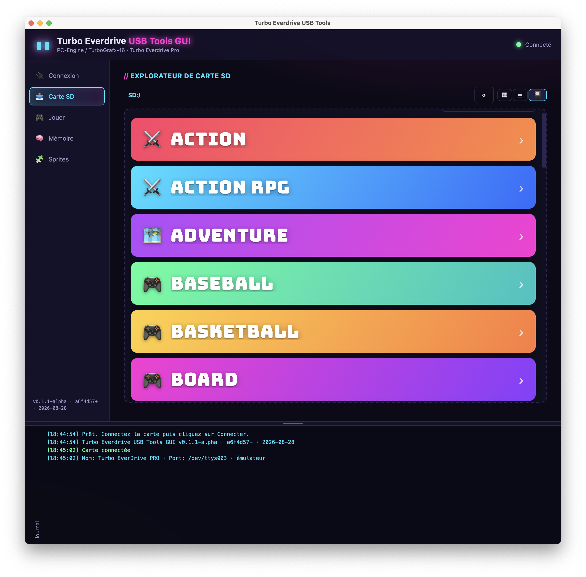
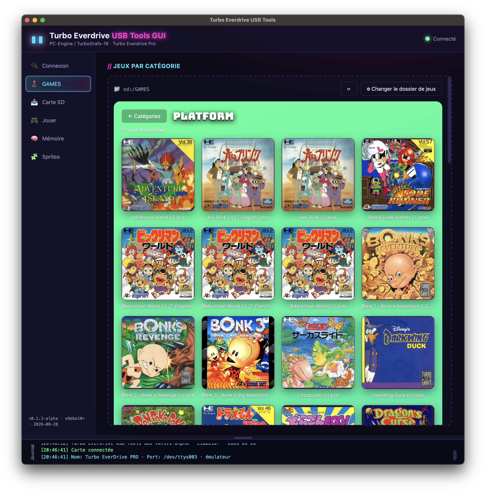
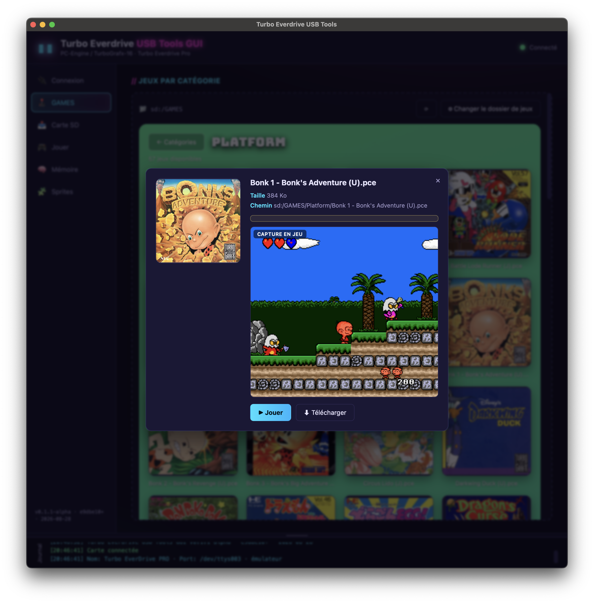

# 🕹️ Turbo Everdrive USB Tools GUI

Outil graphique **cross‑platform** pour la carte **Turbo EverDrive Pro / Core**
(PC‑Engine / TurboGrafx‑16), construit avec un backend **Rust** et une interface
**Tauri** (WebView).

Il permet de gérer les fichiers sur la carte SD, de lancer des ROMs, de
réinitialiser la console, de capturer l'écran du menu et de lire l'état de la
carte — le tout relié à la cartouche par **USB série** (CDC).

<p align="center">
  
  
  
</p>

> ⚠️ **Version 0.1.1‑alpha — état : M2.** Protocole, interface graphique, listing
> SD, transferts asynchrones avec barre de progression et visualiseur mémoire
> sont implémentés. La validation sur matériel requiert que le **menu OS** de la
> cartouche soit affiché et la console alimentée (voir [Vérification
> matérielle](#vérification-matérielle)).
>
> La version affichée dans l'app (bas de la barre latérale) et par
> `edlink-emulator --version` inclut le hash git et la date : elle est
> régénérée à chaque compilation (`crates/*/build.rs`). Un `+` après le hash
> signale un arbre de travail modifié. Numéro unique : `version` dans
> [`Cargo.toml`](Cargo.toml) (`[workspace.package]`).

---

## Table des matières

- [Fonctionnalités](#fonctionnalités)
- [Architecture](#architecture)
- [Prérequis](#prérequis)
- [Build & lancement](#build--lancement)
- [Utilisation](#utilisation)
- [Guide utilisateur complet](docs/GUIDE_UTILISATEUR.md)
- [Vérification matérielle](#vérification-matérielle)
- [Grille de test (QA)](#grille-de-test-qa)
- [Limitations connues](#limitations-connues)
- [Feuille de route](#feuille-de-route)
- [Dépôt](#dépôt)
- [Références](#références)

---

## Fonctionnalités

| Fonction | Description |
|---|---|
| **Connexion** | Détection automatique du port série de la carte (ou choix manuel) |
| **Infos carte** (`devinf`) | Nom, n° de série, versions, compteurs, tensions |
| **Carte SD** (onglet) | Explorateur ; envoi (glisser‑déposer) et téléchargement de fichiers via le protocole FatFs de la carte, avec barre de progression ; clic droit sur un fichier → menu contextuel (Jouer, Renommer, Télécharger, Effacer) |
| **GAMES** (onglet 🕹️, sous Connexion) | Navigateur en deux niveaux ancré sur un dossier de base configurable (défaut `sd:/GAMES`, persisté) : liste colorée des sous-dossiers (catégories, ex. Action/RPG/Plateforme) façon Recalbox, puis mosaïque des ROM de la catégorie (fond repris de la couleur de la catégorie) avec jaquette [Libretro Thumbnails](https://github.com/libretro-thumbnails) (correspondance exacte puis recherche approchée avec score, ⚙ pour corriger manuellement — nécessite Internet, mise en cache locale) ; clic sur un jeu → fiche détaillée (taille, écran-titre et capture en jeu alternés toutes les 2 s) avec « Jouer » et « Télécharger » |
| **Lancer un jeu** (`run`) | Déploie la ROM sur la SD (`sd:/usb-games/`) puis la lance |
| **Reset** | Réinitialise la console |
| **Capture d'écran** | Capture le menu de la carte (VRAM + palette → PNG) |
| **Visualiseur mémoire** (lecture seule) | RAM HuCard via `memrd` ; VRAM/CRAM via l'instantané `*v` du menu |
| **Sprites / tuiles VRAM** | Planche de cellules 4 bpp décodées de la VRAM : 8×8 (fond) ou les 6 tailles de sprite du VDC (16×16 à 32×64), choix de palette, zoom, clic (ou glisser pour une plage) → adresse VRAM + n° de pattern ; « 🔒 Locker » recadre la vue sur la seule sélection ; export PNG de la planche ou de la seule sélection |

## Architecture

```
Turbo Everdrive USB Tools GUI/
├── Cargo.toml                 # workspace Rust (numéro de version unique)
├── crates/
│   ├── edlink-core/           # protocole EverDrive (bibliothèque, sans GUI)
│   │   └── src/
│   │       ├── link.rs        #   couche série (découverte, trames, endian)
│   │       ├── ted.rs         #   pilote Turbo EverDrive (opérations haut niveau)
│   │       ├── protocol.rs    #   codes de commandes
│   │       ├── image.rs       #   VRAM → PNG
│   │       └── error.rs       #   erreurs
│   ├── cli/                   # CLI de validation sur matériel
│   ├── emulator/              # émulateur virtuel TED Pro (tests sans matériel)
│   │   └── src/
│   │       ├── main.rs        #   CLI (--sd, --device pro|core)
│   │       ├── pty.rs         #   pseudo-terminal = port série virtuel
│   │       ├── sd.rs          #   carte SD virtuelle (dossier local)
│   │       └── device.rs      #   répondeur du protocole EverDrive
│   └── app/                   # application Tauri (backend + frontend web)
│       ├── src/lib.rs         #   commandes Tauri exposées au frontend
│       ├── frontend/          #   interface web (HTML/CSS/JS, thème retrowave)
│       ├── tauri.conf.json
│       └── capabilities/
├── reference/edlink/          # source officielle krikzz/edlink (MIT) clonée
├── docs/                      # documentation détaillée
│   └── qa-checklist.html      #   grille de test QA autonome (voir plus bas)
└── scripts/gen_icon.py        # générateur d'icône
```

Le protocole est un **port Rust** de la référence officielle
[krikzz/edlink](https://github.com/krikzz/edlink) (MIT), et non une
ré‑implémentation « au doigt mouillé » : la correspondance avec chaque fichier
C# est documentée dans [docs/PROTOCOL.md](docs/PROTOCOL.md).

## Prérequis

- **Rust** (stable) + Cargo
- **Tauri CLI** : `cargo install tauri-cli`
- macOS : Xcode Command Line Tools ; Linux : dépendances WebKitGTK ; Windows : aucune en plus

## Build & lancement

```bash
# 1. Compiler la bibliothèque de protocole
cargo build -p edlink-core

# 2. Lancer l'interface graphique (mode dev)
cd crates/app
cargo tauri dev

# 3. (Option) Produire un bundle installable
cd crates/app
cargo tauri build
```

### CLI de validation

Le binaire `edlink-cli` reste utile pour tester le protocole sans interface :

```bash
cargo run -p edlink-cli -- --port /dev/cu.usbmodemXXXX devinf
cargo run -p edlink-cli -- --port /dev/cu.usbmodemXXXX ls "sd:/GAMES"
cargo run -p edlink-cli -- --port /dev/cu.usbmodemXXXX cp local.pce "sd:GAMES/local.pce"
cargo run -p edlink-cli -- --port /dev/cu.usbmodemXXXX run "sd:GAMES/local.pce"
cargo run -p edlink-cli -- --port /dev/cu.usbmodemXXXX mv "sd:GAMES/old.pce" "sd:GAMES/new.pce"
cargo run -p edlink-cli -- --port /dev/cu.usbmodemXXXX rm "sd:GAMES/new.pce"

# Capturer la trame série brute (validation protocole sur vraie carte) :
EDLINK_TRACE=1 cargo run -p edlink-cli -- --port /dev/cu.usbmodemXXXX ls "sd:/GAMES"
```

> Sur macOS, utilisez le port **`/dev/cu.*`** (call‑up) et non `/dev/tty.*`,
> qui attend le signal *carrier* non émis par la cartouche.

## Émulateur virtuel (sans matériel)

Le crate `edlink-emulator` simule une **Turbo EverDrive Pro / Core** sur un
**port série virtuel (PTY)** : l'application se connecte dessus exactement
comme sur une vraie cartouche. La **carte SD est un dossier local**, et le
périphérique virtuel reproduit les commandes, réponses, états et erreurs du
protocole (identité, infos, tensions, mémoire, FIFO du menu `*v`/`*i`/`*s`,
opérations fichiers FatFs, reset).

```bash
# Lance l'émulateur (carte SD par défaut = ~/SD_PCE, modèle PRO)
cargo run -p edlink-emulator -- --device pro

# Autre dossier / modèle : --sd <dossier> [--device pro|core]
cargo run -p edlink-emulator -- --sd /tmp/emu_sd --device pro
```

Au démarrage, le chemin du port virtuel est affiché (ex: `/dev/ttys001`).
Connectez‑vous à ce chemin :

```bash
# CLI
./target/debug/edlink-cli --port /dev/ttys001 devinf
./target/debug/edlink-cli --port /dev/ttys001 screen menu.png

# Interface graphique : onglet Connexion → champ "Port manuel (émulateur / PTY)"
#   saisir /dev/ttys001 puis Connecter
```

> ℹ️ Sur macOS, ce port n'apparaît **pas** dans la liste déroulante automatique
> (le scan IOKit de `serialport` ne recense que les périphériques USB) : utilisez
> donc le **port manuel**. Côté `edlink-core`, l'ouverture retente automatiquement
> avec un débit nul quand le réglage du baud échoue sur un PTY, afin de
> fonctionner sans ambiguïté.

L'émulateur reste actif après chaque déconnexion (comme une carte branchée) et
réinitialise son état par session. Commandes utiles :

| Commande | Comportement émulé |
|---|---|
| `devinf` | Infos carte (série `TEDP…`, versions, tensions `05.00/02.50/01.20`) |
| `ls` | Liste un dossier de la carte SD virtuelle (`CMD_F_DIR_OPN`/`DIR_RD`) |
| `cp` | Lit/écrit dans le dossier local (carte SD virtuelle), gère les sous‑dossiers |
| `run` | Copie la ROM vers `sd:/usb-games/`, la charge en RAM0, la « lance » |
| `screen` | Renvoie un PNG 320×224 (dégradé de couleurs = le « menu » virtuel) |
| `memrd` | Lit la RAM0 (motif ou ROM chargée) et autres zones |
| `reset` | Réinitialise la console (état du menu) |

## Utilisation

*Résumé rapide ci-dessous — pour un guide pas à pas destiné à l'utilisateur
final (installation, chaque onglet en détail, dépannage courant), voir
[`docs/GUIDE_UTILISATEUR.md`](docs/GUIDE_UTILISATEUR.md).*

1. Branchez la cartouche en USB et affichez le **menu OS** de la carte.
2. Lancez l'app puis **Connecter** (le port se détecte automatiquement).
3. Onglet **GAMES** : dossier de base `sd:/GAMES` par défaut (⚙ pour le
   changer) — catégories = ses sous-dossiers ; clic sur une catégorie →
   mosaïque des ROM avec jaquette ; clic sur un jeu → fiche détaillée
   (Jouer/Télécharger).
4. Onglet **Carte SD** : parcourez la carte, déposez des fichiers pour les
   envoyer (barre de progression), double‑cliquez pour télécharger, **clic
   droit** sur un fichier pour Jouer/Renommer/Télécharger/Effacer.
5. Onglet **Jouer** : **Choisir et lancer…** déploie puis lance la ROM.
6. **Capturer l'écran** affiche le menu de la carte (format PNG).
7. Onglet **Mémoire** : RAM HuCard (via `memrd`), VRAM/CRAM (instantané `*v`,
   menu affiché).
8. Onglet **Sprites** : planche de tuiles décodées de la VRAM ; choisissez la
   taille de cellule (8×8 fond, ou 16×16 à 32×64 pour les 6 tailles de sprite
   du VDC), la palette et le zoom ; cliquez une cellule pour son adresse VRAM
   et son n° de pattern, ou **glissez** pour sélectionner une plage — l'export
   PNG n'enregistre alors que la zone choisie. « 🔒 Locker » recadre la vue sur
   cette seule sélection (le reste de la VRAM disparaît) : pratique pour
   surveiller un même sprite au fil de « 🔄 Capturer » (ex. une animation). La
   sélection reste posée sur la **même zone VRAM** même en changeant la taille
   de cellule ou le nombre de colonnes (recalculée dans la nouvelle grille).
   « ✕ Sélection » ou <kbd>Échap</kbd> efface tout et revient à la planche
   complète.

## Vérification matérielle

Le lien USB de la cartouche n'est actif que lorsque le **menu (OS)** de la
carte est affiché à l'écran, la console étant alimentée. Si aucun octet n'est
reçu (test `probe`), vérifiez :

- que la console est allumée et que le menu EverDrive est visible ;
- que le bon port est utilisé (`/dev/cu.*` sur macOS) ;
- que le câble USB est bien un câble **données** (pas charge seule).

```bash
# Test brut de connectivité : doit afficher "total bytes received: N" (N>0)
./target/debug/edlink-cli --port /dev/cu.usbmodemXXXX probe
```

## Grille de test (QA)

[`docs/qa-checklist.html`](docs/qa-checklist.html) est un formulaire de
validation **autonome** (fichier local, aucune dépendance, aucun réseau) à
ouvrir dans un navigateur — pratique pour faire tester le build par quelqu'un
sans Rust/Cargo installé (ex. un testeur Windows qui reçoit juste le zip).
Reprend la palette « retrowave » de l'application.

- Grille de tests par section (Connexion, Carte SD, Jouer, Mémoire, Sprites,
  Général) : statut ☐ / ✅ / ❌ / ➖ + commentaire par ligne, barre de
  progression sticky.
- **📎 Capture d'écran par ligne** — redimensionnée (≤ 1400 px) et réencodée en
  JPEG côté navigateur, aperçu en cliquant la vignette ; **💾 Télécharger en
  .zip** regroupe toutes les captures jointes en un seul fichier (écrivain ZIP
  maison, sans dépendance).
- **📝 Générer le Markdown** produit un rapport prêt à coller dans un e-mail
  (infos de test, résumé, tableau des résultats, notes, liste des captures).
- Sauvegarde automatique dans le navigateur (`localStorage`) ; rien n'est
  envoyé nulle part.

## Limitations connues

- **Listing de dossiers SD** : `CMD_F_DIR_OPN` / `CMD_F_DIR_RD` ne sont câblés
  ni par `edlink` ni par `turbolink.exe` (aucun outil officiel n'expose de
  `ls`). Protocole confirmé par désassemblage IL de `turbolink.exe` (bug
  initial trouvé et corrigé : `CMD_F_DIR_RD` attend un argument `u16` non
  envoyé) — cf. `docs/PROTOCOL.md`. Fonctionne sur l'émulateur ; à
  reconfirmer sur matériel réel.
- **Vue « Jeux »** : suppose une arborescence `<dossier de base>/<Catégorie>/<ROM>`
  (ex. `sd:/GAMES/Action/Jeu.pce`) — un fichier posé directement dans le
  dossier de base, sans sous-dossier catégorie, n'apparaît pas dans cette
  vue (utiliser la vue Liste/Icônes pour tout voir). Le dossier de base est
  mémorisé dans le stockage local du navigateur intégré (persiste entre
  lancements de l'appli, propre à la machine).
- **Jaquettes** : correspondance par nom entre le fichier ROM
  (souvent en convention GoodTools/TOSEC, ex. « Jeu (U).pce ») et la base
  Libretro (convention No-Intro, « Jeu (USA).png »), en deux temps : d'abord
  quelques substitutions de code région connues (confiance 100%), puis en
  repli une **recherche au plus proche** dans l'index complet du dépôt
  (téléchargé une fois via l'API GitHub, mis en cache indéfiniment) —
  correspondance acceptée à partir de 80% de similarité de texte ; en dessous,
  ou par prudence, la fiche de détail affiche le titre trouvé et son score
  quand ce n'est pas une variante exacte. Nécessite une connexion Internet
  (requêtes HTTPS vers `raw.githubusercontent.com`/`api.github.com` depuis le
  backend Rust, jamais depuis la carte/le port série) ; résultats mis en cache
  localement (dossier cache de l'application) après le premier essai, y
  compris les échecs, pour ne plus jamais retaper le réseau pour un jeu déjà
  su sans jaquette. Pour corriger un jeu non trouvé ou mal trouvé : bouton ⚙
  sur sa vignette (mosaïque) pour associer manuellement le titre exact tel qu'il
  apparaît dans Libretro Thumbnails — association mémorisée (stockage local).
- **TED Pro non compatible RTC** via `edlink` (`RtcSet`/`RtcCal` lèvent
  `UnsupportedCmd`) : le RTC n'est pas exposé.
- **Lecture mémoire (`memrd`) = bus cartouche** : sur matériel réel, chaque
  lecture de la vue *Mémoire* gèle brièvement le CPU PC-Engine (temps ∝ taille).
  Elle passe en mode conservateur hors émulateur (petits blocs, pas de lecture
  auto). Les vues *VRAM / CRAM* utilisent l'instantané `*v` du menu (comme la
  capture d'écran) et restent disponibles partout, menu affiché. Cf.
  `docs/PROTOCOL.md`.
- **Panne du port série récupérable seulement par reconnexion** : une erreur
  d'E/S peut laisser le port série inutilisable pour le reste de la session
  (constaté sur matériel réel). L'app détecte ce cas (message « connexion
  perdue ») et repasse en « Déconnecté » automatiquement plutôt que de
  répéter la même erreur en boucle — il suffit alors de **Connecter** à
  nouveau.
- Non testé sur matériel tant que le menu OS n'est pas accessible.

## Feuille de route

- **M1 ✅** Fondations : workspace, protocole, CLI, app Tauri, frontend
  retrowave, connexion, infos, transferts, run, reset, capture, memrd.
- **M2 ✅** Listing SD via `CMD_F_DIR_*` ; transferts asynchrones (thread dédié,
  interface réactive) + barre de progression ; visualiseur mémoire (RAM en mode
  conservateur sur matériel, VRAM/CRAM via `*v`) ; planche de tuiles VRAM
  (sprites) ; détection émulateur/matériel ; version de build injectée à la
  compilation ; grille de test QA autonome (`docs/qa-checklist.html`).
- **M3** Sauvegarde/chargement de HuCard complète (via `memrd`/`memwr`), tests
  de vitesse USB (`usbspd`), diagnostics (`diag`).
- **M4** Packager/icônes finales, intégration continue, validations multiplateforme.

## Dépôt

Miroité sur deux serveurs (mêmes commits) :

- `http://kiwinas:8418/eddy/USB-Tools-GUI.git` (`origin`)
- `git@github.com:beddy70/USB-Tools-GUI.git` (`github`)

## Références

- [krikzz/edlink](https://github.com/krikzz/edlink) — référence officielle (MIT)
- [Tauri](https://tauri.app) — framework applicatif
- [serialport (Rust)](https://crates.io/crates/serialport) — accès ports série

## Licence

MIT — ce projet est un port du protocole de [`krikzz/edlink`](https://github.com/krikzz/edlink)
(MIT). Les marques *EverDrive*, *Turbo EverDrive* appartiennent à leurs
propriétaires respectifs.
